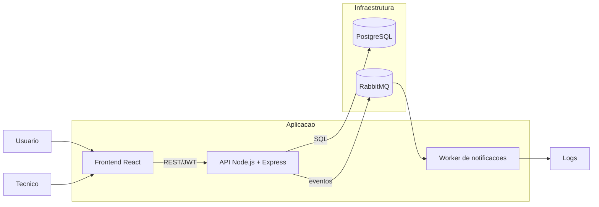
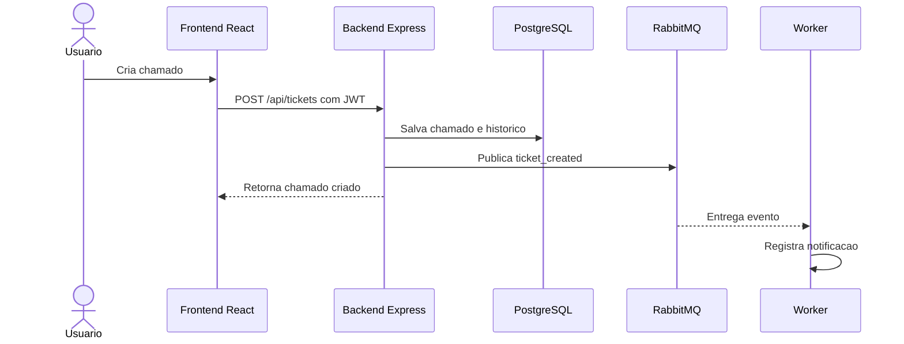
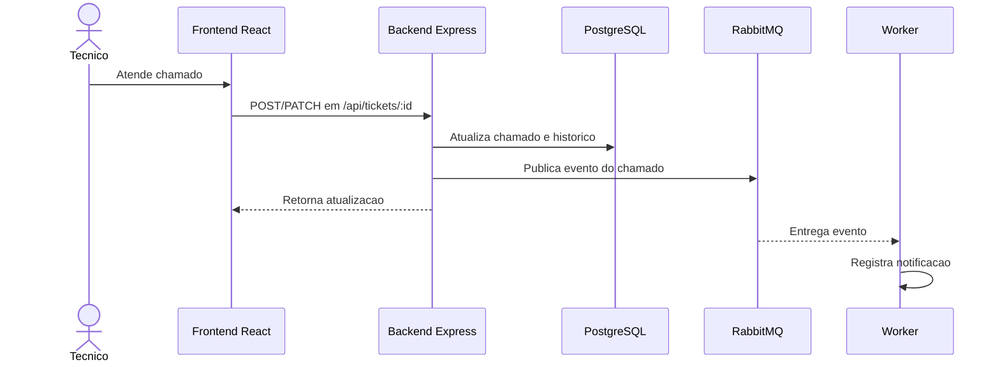

# Diagrama de Arquitetura

Este documento registra a arquitetura atual do sistema de gerenciamento de chamados.

## Visao geral

## Fluxo principal de chamados

## Fluxo de atendimento tecnico

## Componentes e responsabilidades

| Componente | Tecnologia | Responsabilidade |
| --- | --- | --- |
| Frontend | React + Vite | Interface de usuario e tecnico, consumo da API REST |
| Nginx | nginx:alpine | Servir o build estatico do frontend no Docker |
| Backend | Node.js + Express | Autenticacao JWT, regras de chamado, endpoints REST |
| PostgreSQL | postgres:16-alpine | Persistencia de usuarios, categorias, chamados, historico e migrations |
| RabbitMQ | rabbitmq:3-management-alpine | Mensageria assincrona de eventos de chamados |
| Worker | Node.js | Consumir fila `ticket.notifications` e simular notificacoes em log |
| GitHub Actions | CI | Rodar testes, migrations, cobertura, build e SonarCloud |
| SonarCloud | Qualidade | Analise estatica e quality gate |

## Execucao com Docker Compose

| Servico | Funcao | Porta no host |
| --- | --- | --- |
| `frontend` | Serve a interface React com Nginx | `5173` |
| `backend` | Executa a API REST | `3001` |
| `db` | Banco PostgreSQL | `5433` |
| `rabbitmq` | Broker de mensagens e painel web | `5672`, `15672` |
| `worker` | Consome eventos do RabbitMQ | Sem porta publica |

## Decisoes arquiteturais principais

- O frontend fica separado do backend para manter responsabilidades claras entre interface e API.
- O backend concentra regras de negocio e validacoes antes de gravar no banco.
- O PostgreSQL e usado como fonte de verdade dos dados do sistema.
- O RabbitMQ e usado para eventos assincronos de chamados, sem bloquear a criacao ou atualizacao do chamado.
- O worker processa notificacoes fora do fluxo principal da API.
- Docker Compose padroniza o ambiente de demonstracao e reduz problemas de configuracao local.
